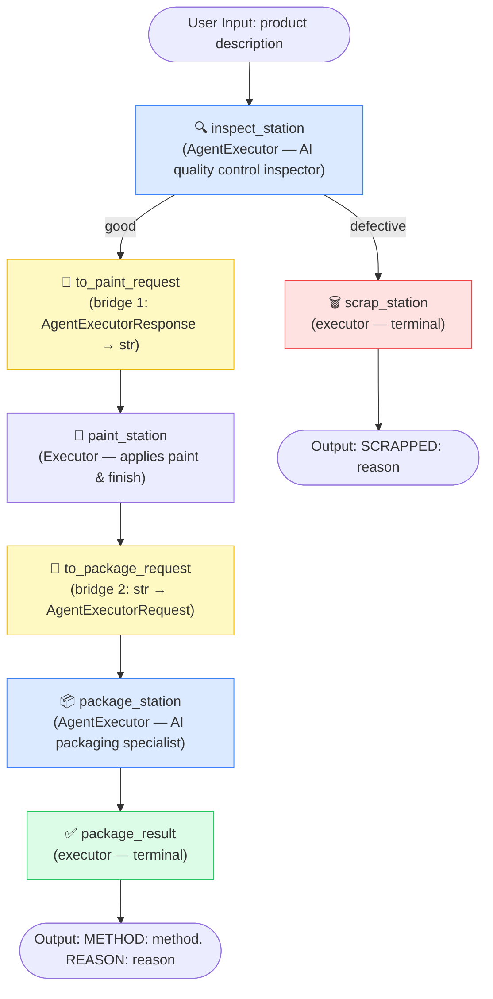

## Factory Assembly Line Workflow

**Node types:**
- 🔵 Blue — `AgentExecutor` (AI agent nodes)
- 🟡 Yellow — Bridge nodes (type adapters between agent and plain executors)
- 🔴 Red — Scrap terminal (defective path)
- 🟢 Green — Package terminal (good path)
